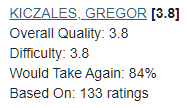

# Who's My Prof?

---

Ever got tired of constantly checking out a professor's ratings whenever you were interested in a specific course?

No longer will this be an issue with this upcoming Google Chrome extension.
It will automatically detect and place a UBC professor's RateMyProfessors rating onto the course selection webpage, 
so you don't have to do the busy work.

Data used in this extension is scraped via 
[UBC Detective](https://github.com/TheRealStevenYan/UBC_Detective).

---

## The Extension

On the course web page:

The first image is without the extension, the second is with the extension.
The professor's RMP quality rating is placed to the right of their name.
When you hover over their quality rating with your cursor, more RMP information is shown:

###More features to come!

A work in progress.

### TODO:
- Detection of professors from course selection page (Only detects course webpage at the moment, not selection page)
- Beautify the code (try modularising it even though manifest v3 hates this)

---

## How to Install

Coming soon!